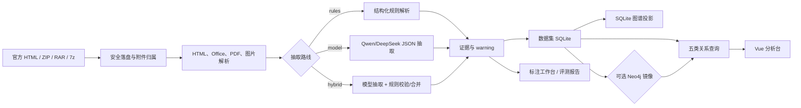

# 系统架构

本文描述当前可运行实现的边界，供开发、评审和提交物编写使用。项目是赛题五的候选抽取与关系分析平台；它不包含官方评分隐藏集，也不把本地 Gold 当成官方真值。

## 端到端数据流



## 组件职责

| 组件 | 位置 | 职责 |
|---|---|---|
| FastAPI 应用 | `backend/app/main.py`、`backend/app/*_api.py` | 导入、查询、评测、后台任务和模型配置 API |
| 附件与文档解析 | `backend/app/parsers.py`、`backend/app/ingestion.py` | 识别文件、展开归档、抽取文本/表格、保留来源和 warning |
| 抽取路线 | `backend/app/model_adapter.py`、`backend/app/package_codes.py` | rules、model、hybrid 三种路线；模型结果必须经过 schema 和证据校验 |
| 持久化 | `backend/app/storage.py` | 每个逻辑数据集一个 SQLite 文件；写入源和离线回退源 |
| 关系分析 | `backend/app/analytics.py`、`backend/app/analytics_backend.py` | 五类查询、金额组装、SQLite/Neo4j 后端切换 |
| Neo4j | `backend/neo4j_runtime/`、`backend/app/graph.py` | 可选的关系查询镜像；失败时按请求回退 SQLite |
| 后台任务 | `backend/app/jobs.py`、`backend/app/jobs_api.py` | 逐公告检查点、暂停、续跑、重试和幂等入库 |
| Web 界面 | `frontend/src/` | 导入、检索、五类分析、人工标注和评审登录 |

## 抽取路线

- `rules` 识别结构化表格、包号、金额和来源证据，适合作为可复现基线和离线兜底。
- `model` 将正文和附件上下文交给合规的 Qwen/DeepSeek 服务，要求返回固定 JSON、七字段、主体和连续原文证据。
- `hybrid` 以模型处理自由文本和附件，以规则完成表格结构、包号归一化、数值检查、来源校验和安全合并。

规则是结构约束和可解释性组件，不代表项目改成“规则为主”。最终路线选择必须在独立 reviewed holdout 上按同一口径比较，不能根据 24 条调优集或单次定向回放宣称 model 或 hybrid 一定最好。

名称型包号只有在模型输出同时包含明确的“分包名称/标段名称/采购包名称/包名称/包名”标签和值，并通过连续原文证据校验时才接受。项目标题、品目名、邻近文字和顺序不能推断包号；无法证明时保留 `default` 并记录 warning。

## 数据集与一致性

SQLite 是写入源。请求通过 `X-Dataset-ID` 选择逻辑数据集；未提供时使用 `default`，未知 ID 返回错误，不静默切回默认库。Neo4j 按数据集维护镜像，在首次查询或 SQLite/WAL 版本变化后同步完整快照，不是增量复制。

五类分析 API 可以由 `ANALYTICS_BACKEND=neo4j` 选择 Neo4j。连接、同步或查询失败时，当前请求回退 SQLite，并通过响应头和前端状态显示实际后端。`/api/v1/graph` 的可视化投影仍读取 SQLite，这一边界不能写成“Neo4j 可视化已完成”。

## 后台任务状态机

```text
created -> running -> paused -> running
                    -> interrupted -> running
                    -> completed
                    -> failed (单公告可重试)
```

每条公告保存输入文件哈希、处理状态、警告和结果检查点。损坏的单条检查点会被隔离；模型超时、429 和非法 JSON 标记为可重试失败，不把失败结果写入业务库。任务完成只表示管线处理完，不表示字段正确。

## 评测边界

官方只提供原始 HTML、压缩包和附件，不提供逐条 Gold。24 条 `gold.merged.json` 是团队自建调优集；`official-holdout-20260929` 中的任务包只包含原始材料和预测，直到两位标注员独立完成并裁决后，才可生成最终 `gold.reviewed.json`。最终三路线评测由 `stage=final` 闸门检查 Gold 独立性、代码冻结、三路线完成度和产物完整性。

本地指标、金额容差、包号集合对齐和重复候选的定义见 [`EVALUATION.md`](EVALUATION.md) 与 [`benchmarks/route-evaluation-runbook.md`](benchmarks/route-evaluation-runbook.md)。所有报告必须注明“团队本地验证，不是官方成绩”。
